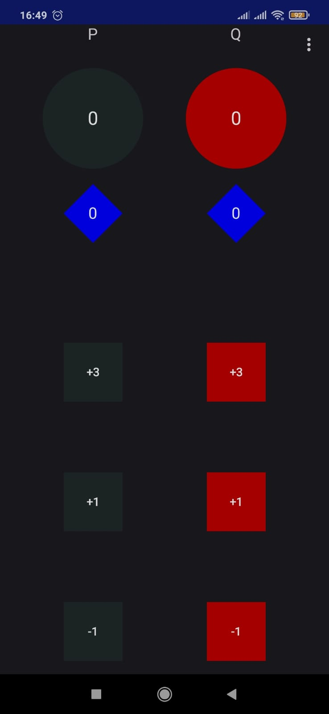
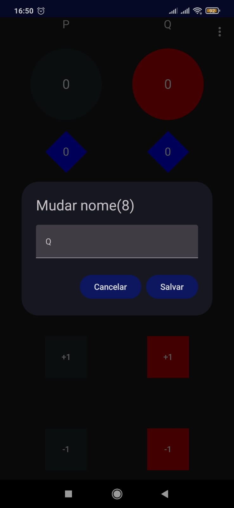
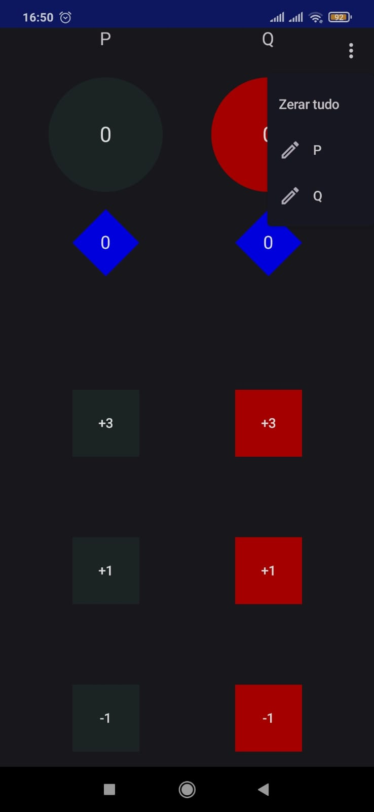
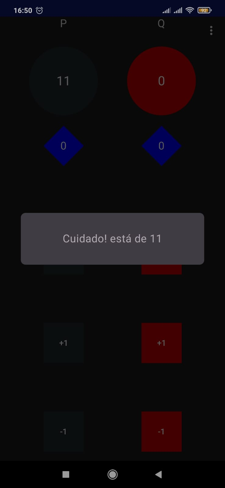

# Content:
- state host / viewModel
- unittest
- instrumental test
- dialog / alert dialog
- sound signal
- LaunchedEffect
- SideEffect
- custom shape
- menu
- internationalization

# Objectives:
    Allow 2 teams to count points and wins while plaing a card game called Truco, in Brazil.
    Each team can change their name, from menu or by clicking the name. Clear all former points.
    While plaing when reach 11 points the game enter a special mode, one more point the team win a victory
    At 11 points a visual and ringing alert is launched

# What I learned
- Move class/functions using ide
- Solve references bug
- Show composable components after some events
- If the code is too complex the solution may is wrong
- I still need to read more android app using compose, function in Kotlin is cool but it seems it
  throws away everything I learned from Java
- Update dependencies using Android Studio

# Why another app ?
By the time I tried to update but I failed. In fact using compose is quite different is some case are easy
other not. For instance: inside my function I want to launch an alert. If this function is not
a Composable this is not so easy. So I start from scratch.

# Screens Shot

